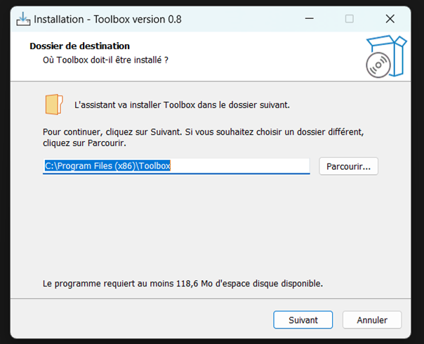
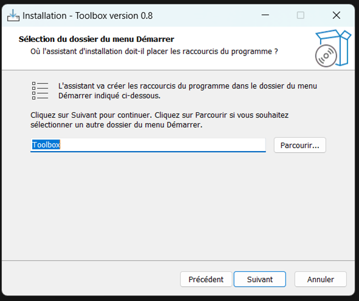
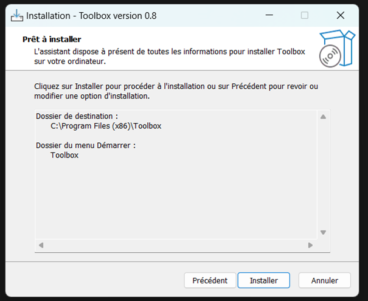
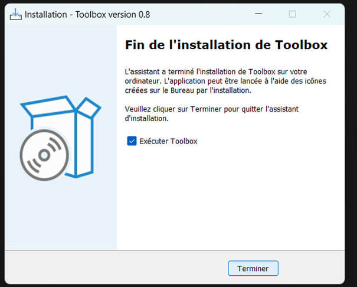
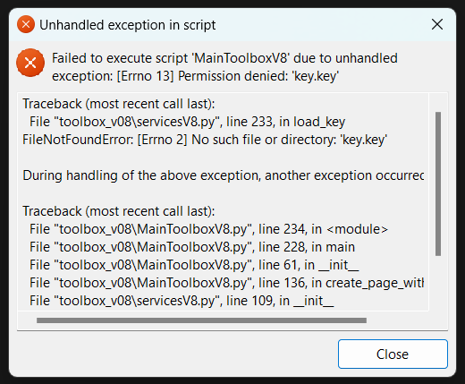
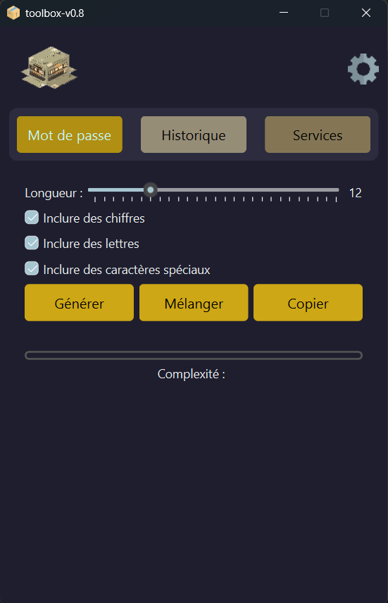
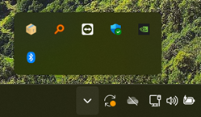

# 🚀 Toolbox (bêta) - Guide Pratique

Bienvenue dans le guide d'installation et d'utilisation de **Toolbox (bêta V08)**, un outil pour gérer et sécuriser vos mots de passe. Dévelloper entre deux cours cette j'utilse cette solution maison tout les jours à des fin personnels un version 1 est en cours de préparation avec des changement important mais garder la base de cette solution.

## 🏗️ Présentation du Projet
**Toolbox** est une application conçue pour faciliter la gestion des mots de passe en proposant des fonctionnalités avancées telles que :
- 🔑 **Générateur de mots de passe sécurisé**
- 🕒 **Historique des mots de passe générés**
- 🏦 **Coffre-fort de mots de passe** pour un stockage sécurisé

Développée en **Python**, Toolbox est simple, efficace et adaptée aux besoins des utilisateurs soucieux de leur cybersécurité.

## 🛠️ Technologies Utilisées
- **Langage :** Python 🐍
- **Librairies :**
  - `functools` pour la gestion des fonctions et optimisations
  - `PySide6` pour l'interface graphique utilisateur (GUI)
  - `Style.qss` pour améliorer l'aspect de certain éléments graphique

## 📥 Installation / Exécution
### 🔹 1. Téléchargement de Toolbox
1. Accédez au dossier de téléchargement `{dossier driver partager}`
2. Téléchargez le fichier **Toolbox.zip**
3. Extrayez le contenu du fichier dans un dossier de votre choix




### 🔹 2. Installation de Toolbox
1. Ouvrez le dossier contenant **ToolboxInstaller.exe**
2. Double-cliquez sur l'exécutable pour lancer l'installation
3. Suivez les instructions :
   - Cliquez sur **"Suivant"**
   - Sélectionnez le dossier d’installation (laisser par défaut si souhaité)
   - Cliquez sur **"Installer"**




```bash
🔹 2.5 Installation de Toolbox autre méthode
1. git clone https://github.com/Navexd/toolbox-windows.git
2. cd toolbox-windows
3. pip install -r requirements.txt
4. python src/main.py
```

### 🔹 3. Premier Lancement
1. **Exécutez Toolbox en tant qu’administrateur** pour éviter les erreurs
2. Toolbox créera automatiquement les fichiers de configuration nécessaires
3. Lors du premier lancement, un fichier **key.key** sera généré pour sécuriser l'accès



## 🔑 Utilisation Principale
### ✅ Interface Principale
1. Ouvrez Toolbox depuis le **menu Démarrer Windows**
2. Explorez les fonctionnalités principales :
   - **Générateur de mots de passe**
   - **Historique des mots de passe générés**
   - **Coffre-fort sécurisé**



### ✅ Génération de Mots de Passe
1. Allez à la section **"Mot de Passe"**
2. Cliquez sur **"Générer"** pour créer un mot de passe aléatoire sécurisé
3. Copiez et enregistrez votre mot de passe

### ✅ Historique des Mots de Passe
1. Accédez à la section **"Historique"**
2. Consultez et récupérez vos mots de passe générés précédemment

### ✅ Coffre-Fort à Mots de Passe
1. Accédez à la section **"Services"**
2. Stockez et gérez vos mots de passe en toute sécurité

### 🚀 Accès Rapide
- Toolbox reste accessible via la **zone de notification Windows** après fermeture
- **Si l'application est fermée ou l’ordinateur redémarre, il faudra la relancer en tant qu’administrateur**



## 🎉 Conclusion
Félicitations ! 🎊 Vous avez installé et configuré **Toolbox** avec succès. Utilisez cet outil pour sécuriser vos mots de passe efficacement.

📢 **Suggestions & Support** : Ouvrez une **issue** sur GitHub si vous avez des questions !

---
📝 *Mis à jour le :* `27 novembre 2024`
💻 *Auteur :* `Nave`
